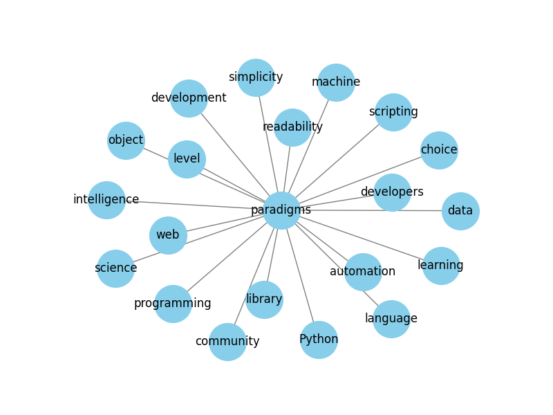

# 🧠 Mind Map Generator from Text

A Python-based Streamlit web app that takes a block of text and automatically generates a **mind map** using NLP and graph visualization. Useful for note summarization, revision planning, or converting text into visual learning material.

---

## 🚀 Features

- 🔍 Extracts key concepts using **spaCy NLP**
- 🧱 Builds relation graph using **NetworkX**
- 🎨 Visualizes a mind map using **Matplotlib**
- 💾 Save mind map as an image (PNG)
- 🌐 Clean and responsive **Streamlit UI**

---

## 🔧 Tech Stack

| Area         | Tools Used                  |
|--------------|-----------------------------|
| Language     | Python 3                    |
| UI Framework | Streamlit                   |
| NLP Engine   | spaCy (`en_core_web_sm`)    |
| Graph Plot   | NetworkX + Matplotlib       |

---

## 📷 Demo Screenshot



---

## 🛠 How to Run Locally

1. Clone the repo:
    ```bash
    git clone https://github.com/anushkapranjale/mindmap-generator.git
    cd mindmap-generator
    ```

2. Install dependencies:
    ```bash
    pip install -r requirements.txt
    python -m spacy download en_core_web_sm
    ```

3. Run the app:
    ```bash
    streamlit run app.py
    ```

---

## 💡 Use Cases

- Students converting textbook material into visual form
- Teachers creating quick concept maps
- Content creators summarizing blogs/articles
- Interview prep via mind mapping tech topics

---

## 🙋‍♀️ About Me

I'm Anushka Pranjale, a Computer Science (Cybersecurity) student passionate about turning ideas into working prototypes.  
💼 Connect with me on [GitHub](https://github.com/anushkapranjale)

---

## 📄 License

MIT License. Feel free to fork & build on top of this.
